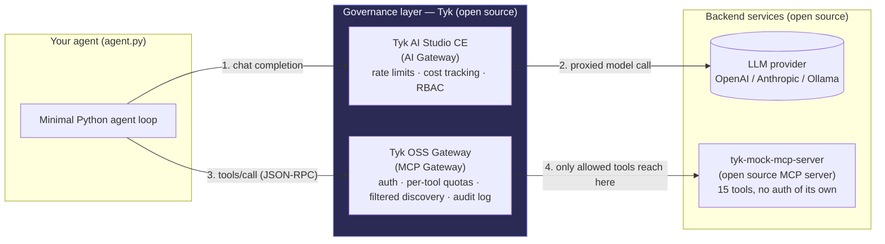

# Deploy an Agent, Then Govern It

### A KCD hands-on lab & live-demo guide — open source AI agents on Kubernetes, governed with Tyk

**Format:** 45–60 minute conference session (live demo, backed by this guide so attendees can rebuild it afterward)
**Audience:** Kubernetes-literate; no prior AI/agent experience assumed
**You'll show:** an agent calling tools through an MCP server and calling an LLM — both fronted by open source Tyk components that enforce auth, rate limits, tool-level access control, and content/PII guardrails

> **Read this first — verify before demo day.** Two of the components here (Tyk's MCP Gateway and the now-open-sourced Tyk AI Studio) are genuinely new, fast-moving projects. The core flows below are grounded in current Tyk documentation and the project READMEs (sources at the bottom), but exact Helm value names can shift between releases. Each step that touches one of these two components has a **⚠ verify** callout — spend 15 minutes running through those against the live docs a day or two before you're on stage, not the morning of.

---

## 1. What you're building



The point of the demo is the two boxes in the middle. The agent never talks to the LLM or the MCP server directly — every call is intercepted by an open source Tyk component that can authenticate it, rate-limit it, filter what it's allowed to see, and log it. That's "governance" made concrete instead of abstract.

Two independent governance stories run in parallel:

| Layer | Component | What it governs | License |
|---|---|---|---|
| Tool calls (MCP) | Tyk OSS Gateway — MCP Gateway feature | Auth, per-agent/per-tool rate limits & quotas, filtered tool discovery, structured access logs | Fully in the OSS gateway (Mozilla Public License) |
| Model calls (LLM) | Tyk AI Studio — Community Edition | Auth, rate limiting, cost/usage tracking, RBAC on who can call which model | Open source (Community Edition) |

Full audit-log persistence and budget *enforcement* on the AI Studio side are Enterprise-only — call that out live rather than promising it, and lean on the MCP Gateway's access logs for the audit-trail beat instead.

---

## 2. Pre-flight checklist (do this **before** the session, not live)

A live `helm install` from a cold cluster for four components will eat your whole slot. Do the heavy lifting ahead of time; the live portion re-runs the fast/visible parts and focuses on the governance payoff.

### 2.1 Tooling on your laptop

- Docker Desktop (or equivalent), with at least 6 GB RAM allocated
- [`kind`](https://kind.sigs.k8s.io/) or `k3d` — this guide uses `kind`
- `kubectl`, `helm` 3+
- Go 1.22+ (only needed to build the mock MCP server image)
- Python 3.10+ with `pip`
- An API key for **one** LLM provider (OpenAI or Anthropic). No key? Skip to the Ollama fallback in §7.

### 2.2 Spin up the cluster

```bash
kind create cluster --name kcd-agent-demo
kubectl cluster-info --context kind-kcd-agent-demo
```

### 2.3 Build and load the MCP server image

`tyk-mock-mcp-server` has no published image — you build it. This is a good live-demo beat in its own right ("here's a plain, boring, open source MCP server — no auth of its own, on purpose").

```bash
git clone https://github.com/TykTechnologies/tyk-mock-mcp-server.git
cd tyk-mock-mcp-server
docker build -t tyk-mock-mcp-server:local .
kind load docker-image tyk-mock-mcp-server:local --name kcd-agent-demo
cd ..
```

### 2.4 Set up Tyk AI Studio

```bash
cd ai-studio
./setup.sh
```

**Verified (2026-08-30):** this replaces what used to be a "clone it and figure out the Helm chart" step. No Kubernetes chart for AI Studio CE was found working as of this build — `ai-studio/setup.sh` instead automates the officially-documented Docker Compose CE quickstart end to end: clone, fix a real port-mismatch bug in the project's own shipped config (its microgateway container crash-loops on "connection refused" without this), bring the stack up, register the first admin account (there is no `ADMIN_EMAIL` env var — the first account to register becomes admin, full stop), and create a demo LLM entry, app, and activated API credential via the admin API. Pass `ANTHROPIC_API_KEY=sk-...` or `OPENAI_API_KEY=sk-...` to also wire up a real key, or leave it unset and add one later via the UI.

The UI is confirmed on **`http://localhost:3000`** (not 8585 — that's Enterprise; the two editions' quickstart docs disagree with each other on this and 3000 is what the CE compose file that actually ships maps to).

> **⚠ Not yet resolved:** the admin/LLM/app/credential setup above is fully confirmed working. The actual live chat-completions call through AI Studio's microgateway (port 9091) is not — the shipped image predates the project's current documentation (its real endpoints are `/llm/*`, not the newer `/v1/chat/completions` path), and the microgateway ("edge") process never actually loads the LLM/app/credential this script creates: its logs repeat "Edge is out of sync with control" every ~30s, permanently — the loaded config snapshot never advances past container start across 5+ minutes of retries or a full restart. A fresh edge rejects the credential outright (401); an older one gets past auth but then reports "LLM not found" (404) — same root cause, different symptom as the edge ages. Rehearse the actual call yourself before demo day — see `ai-studio/setup.sh`'s own final output for the exact curl to test and what to check if it still fails.

### 2.5 Add Helm repos

```bash
helm repo add tyk-helm https://helm.tyk.io/public/helm/charts/
helm repo update
```

### 2.6 Pick your rate limit numbers ahead of time

Decide now what "trip the rate limit live" looks like — e.g. 5 requests/minute on one tool — so you're not doing arithmetic on stage. Write the exact `for` loop you'll paste into the terminal (see §6.5) into your speaker notes.

Checkpoint: cluster up, image loaded, repos added, one working LLM API key in hand. Everything below can now run live in the allotted time.

---

## 3. Live segment 1 — the problem, in one slide (≈5 min)

No terminal yet. State the problem you're solving:

- Agents call tools (via MCP) and models (via an LLM API) directly, with no shared policy layer.
- Every framework reinvents its own auth, rate limiting, and logging — or skips it.
- "Governance" usually means a wiki page nobody reads, applied after an incident.

Show the architecture diagram from §1. Say the thesis plainly: *put an open source gateway in front of both paths, and governance becomes infrastructure instead of a policy document.*

---

## 4. Live segment 2 — stand up the governed tool path (≈12 min)

### 4.1 Deploy Redis + Tyk OSS Gateway

```bash
NAMESPACE=tyk-oss
kubectl create namespace $NAMESPACE

REDIS_BITNAMI_CHART_VERSION=19.0.2
helm upgrade tyk-redis oci://registry-1.docker.io/bitnamicharts/redis \
  -n $NAMESPACE --install --version $REDIS_BITNAMI_CHART_VERSION \
  --set auth.password=demoRedisPass \
  --set image.repository=bitnamilegacy/redis \
  --set volumePermissions.image.repository=bitnamilegacy/os-shell \
  --set sentinel.image.repository=bitnamilegacy/redis-sentinel \
  --set metrics.image.repository=bitnamilegacy/redis-exporter

APISecret=kcd-demo-secret

helm upgrade tyk-oss tyk-helm/tyk-oss -n $NAMESPACE --create-namespace --install \
  --set global.secrets.APISecret="$APISecret" \
  --set global.redis.addrs="{tyk-redis-master.$NAMESPACE.svc.cluster.local:6379}" \
  --set global.redis.passSecret.name=tyk-redis \
  --set global.redis.passSecret.keyName=redis-password
```

> **Verified (2026-08-29), a real fix:** the exact pinned Bitnami redis tag (`7.2.4-debian-12-r9`) 404s from `docker.io/bitnami/redis` — Bitnami/Broadcom moved older free-tier tags to `docker.io/bitnamilegacy/*` in 2025. The `--set image.repository=bitnamilegacy/redis` (and matching overrides for the sentinel/exporter/volume-permissions sub-images) above is what actually pulls on a fresh cluster today; without it every redis pod sits in `ImagePullBackOff`. If a pod is still stuck on the old image after upgrading, `kubectl delete pod` it — StatefulSet pods don't always pick up an image change from a bare `helm upgrade` on their own.

> **Verified (2026-08-29):** MCP Gateway needs Tyk Gateway **5.13+**, and the full feature set (rate limiting, per-consumer RBAC, filtered discovery, allowlisting) ships in the OSS gateway per [tyk.io/tyk-mcp-gateway](https://tyk.io/tyk-mcp-gateway/) — only upstream OAuth2 client-credentials auth and the control-plane management layer are Enterprise. The `tyk-helm/tyk-oss` chart's default `image.tag` is already `v5.13.1`+, but pin it explicitly so a chart bump doesn't surprise you on stage: `--set tyk-gateway.gateway.image.repository=docker.tyk.io/tyk-gateway/tyk-gateway --set tyk-gateway.gateway.image.tag=v5.13.2`. Note: 5.13.1+ images run as non-root (numeric UID 65532) — irrelevant for this guide's plain Deployment, but worth knowing if you add a `securityContext`.

```bash
kubectl -n $NAMESPACE get pods -w
```

Talking point while pods come up: this is a completely ordinary API gateway deployment — nothing agent-specific yet. That's deliberate: the same gateway your platform team already runs for REST APIs is what's about to govern your agent.

### 4.2 Deploy the (deliberately unguarded) MCP server

```yaml
# mcp-server.yaml
apiVersion: apps/v1
kind: Deployment
metadata:
  name: mock-mcp-server
  namespace: tyk-oss
spec:
  replicas: 1
  selector:
    matchLabels: { app: mock-mcp-server }
  template:
    metadata:
      labels: { app: mock-mcp-server }
    spec:
      containers:
        - name: mock-mcp-server
          image: tyk-mock-mcp-server:local
          imagePullPolicy: IfNotPresent
          ports: [{ containerPort: 7878 }]
---
apiVersion: v1
kind: Service
metadata:
  name: mock-mcp-server
  namespace: tyk-oss
spec:
  selector: { app: mock-mcp-server }
  ports: [{ port: 7878, targetPort: 7878 }]
```

```bash
kubectl apply -f mcp-server.yaml
kubectl -n tyk-oss get svc mock-mcp-server
```

Talking point: `curl` this from inside the cluster and show it just answers — **no API key, no rate limit, no audit trail**. That gap is exactly what the next step closes.

### 4.3 Register it as a governed MCP proxy in Tyk

Tyk models every remote MCP server as a Tyk OAS API definition — an OpenAPI 3.0 document plus an `x-tyk-api-gateway` extension block that carries the MCP-specific policy (auth, tool allowlisting; rate limits are set on the key, see §6.4). **Verified (2026-08-31)** against `tyk-mock-mcp-server`'s actual tool list and the current MCP proxy schema — the tool allowlist lives at `middleware.mcpTools.{toolName}.allow.enabled` (per tool, not a single array). `tyk-mock-mcp-server` actually exposes 15 tools (`get_users`, `create_user`, `update_user`, `delete_user`, `get_posts`, `create_post`, `get_products`, `process_order`, `get_analytics`, `generate_report`, `validate_email`, `generate_uuid`, `format_date`, `get_anything`, `slow_response`) — there is no `list_users` or `get_user` tool, so the allowlist below uses real names:

```json
{
  "openapi": "3.0.3",
  "info": { "title": "mock-mcp", "version": "1.0.0" },
  "paths": { "/mcp": { "post": {}, "get": {} } },
  "x-tyk-api-gateway": {
    "info": { "name": "mock-mcp-governed", "state": { "active": true } },
    "server": {
      "listenPath": { "value": "/mcp-gw/", "strip": true },
      "authentication": { "enabled": true, "authToken": { "enabled": true } }
    },
    "upstream": { "url": "http://mock-mcp-server.tyk-oss.svc.cluster.local:7878" },
    "middleware": {
      "mcpTools": {
        "get_anything": { "allow": { "enabled": true } },
        "get_users": { "allow": { "enabled": true } },
        "get_products": { "allow": { "enabled": true } }
      }
    }
  }
}
```

The rate limit isn't set here — it lives on the **key**, not the API definition (see §6.4's callout for why).

Register it against the Gateway API (no Dashboard needed on OSS):

```bash
kubectl -n tyk-oss port-forward svc/gateway-svc-tyk-oss-tyk-gateway 8080:8080 &

curl -s http://localhost:8080/tyk/mcps \
  -H "x-tyk-authorization: $APISecret" \
  -H "Content-Type: application/json" \
  -d @mcp-proxy.json

curl -s http://localhost:8080/tyk/reload/group -H "x-tyk-authorization: $APISecret"
```

> **⚠ Verified (2026-08-31), the single most important finding in this whole guide.** That's `POST /tyk/mcps`, **not** `/tyk/apis/oas`. Registering an MCP proxy through the generic OAS endpoint creates a perfectly working reverse proxy — MCP traffic flows fine either way — but it never sets `ApplicationProtocol="mcp"` on the API definition, and `IsMCP()` staying false silently disables **both** the tool-allowlist enforcement and per-tool rate limiting (found by reading the gateway's own Go source, `apidef.APIDefinition.IsMCP()` / `MarkAsMCP()`). Nothing errors — the governance features just never engage, which is exactly why this went unnoticed until now. `POST /tyk/mcps` (list: `GET /tyk/mcps`, update: `PUT /tyk/mcps/{id}`) is the dedicated endpoint that actually marks it as MCP. `setup.sh` already uses the correct one.

Create a key scoped to this proxy (via `/tyk/keys`) and show one authenticated `tools/list` call succeeding through `localhost:8080/mcp-gw/mcp` — and, ideally, one *unauthenticated* call to the same path failing. That's the whole pitch for this section in two curl commands.

> **Verified (2026-08-29), a real gotcha:** the upstream `tyk-mock-mcp-server` registers its handler at the exact path `/mcp` (no trailing slash, exact match, no subtree routing). If your `listenPath` is also `/mcp/` and clients also call `.../mcp/`, the stripped remainder is empty and every call 404s from the *upstream* server (a plain-text 404, not Tyk's JSON error shape — that's the tell). Use a **different** listenPath prefix (`/mcp-gw/`) so the client's URL (`.../mcp-gw/mcp`) leaves `mcp` as the stripped remainder Tyk forwards upstream. This repo's `tyk/mcp-proxy.json` already reflects this fix.

---

## 5. Live segment 3 — stand up the governed model path (≈10 min)

### 5.1 Tyk AI Studio (Community Edition) is already up from pre-flight

This runs on the host via Docker Compose, not in the kind cluster — say so plainly: "in production this runs as pods like everything else — for the demo I'm keeping the LLM control plane on the host so a network hiccup doesn't take down the whole talk." Judges (and audiences) respect an honest fallback far more than a stalled `helm install`. **No Kubernetes chart for CE is confirmed working as of this build** — the docker-compose path in `ai-studio/setup.sh` (§2.4) is the one to use.

```bash
open http://localhost:3000   # sign in: admin@kcd-workshop.local / Workshop-Demo-2026!
```

### 5.2 Show the provider setup

`ai-studio/setup.sh` already created a `workshop-llm` entry, a `workshop-agent` app with access to it, and an activated API credential — all confirmed live against the admin API. Walk through the UI: the LLM entry, the app, and (once real traffic flows) the cost/usage panel. If you passed a real `ANTHROPIC_API_KEY`/`OPENAI_API_KEY` to the setup script, the key is already wired in; otherwise add one now under the `workshop-llm` entry.

### 5.3 Talking point — and the one honest gap

Same shape as §4: an ordinary LLM call now goes through a gateway that can enforce who's allowed to call which model, track cost per caller, and — on the Enterprise tier — enforce hard budgets. Community Edition gives you the admin/RBAC/cost-tracking model; that's already most of what a KCD audience needs to see.

**Verified (2026-08-31), a real live beat that doesn't depend on the microgateway bug below:** `workshop-agent`'s `llm_ids` is a genuine, live-testable RBAC control at the control-plane API (port 3000) — PATCH it to include every configured LLM and the app can call any of them; PATCH it down to one and it can't touch the others. This is confirmed by reading the app back after each PATCH, and it's independent of the completions-call bug, since it's enforced (and inspectable) entirely within the admin API/UI. See `CHEATSHEET.md` §2 for the exact commands — "unguarded" then "simple RBAC" as two live steps.

**⚠ Rehearse the live call before you're on stage — this is the one piece of the whole workshop that isn't confirmed working.** The microgateway's edge process never actually loads the LLM/app/credential AI Studio just created — its logs repeat "Edge is out of sync with control" every ~30s, permanently, with the loaded config stuck at container-start forever in testing (confirmed over 5+ minutes and a full restart). This is a likely real gap between the shipped image and the project's current docs, not a one-off misconfiguration (see `ai-studio/setup.sh`'s header comment for the full trail). If you get it working before your talk, great — say so and show it. If not, the honest line is exactly the same shape as the MCP allowlist finding in §6: "the governance *model* — auth, RBAC, cost tracking — is real and running; here's the admin console proving it. The specific completions call has a wrinkle I'm still chasing with the project." That is a stronger talk than a silently botched live demo.

---

## 6. Live segment 4 — run the agent, then break it on purpose (≈15 min)

### 6.1 Install and configure

```bash
python3 --version   # needs 3.10+ — agent.py uses `dict | None` (PEP 604) syntax
python3 -m venv .venv && source .venv/bin/activate   # sidesteps macOS's "externally-managed-environment" pip error
pip install -r requirements.txt
export TYK_MCP_URL="http://localhost:8080/mcp-gw/mcp"
export TYK_MCP_KEY="$(cat /tmp/tyk_mcp_key.txt)"   # written by ./setup.sh
```

> **Verified (2026-08-31), two real onboarding gotchas:** macOS's built-in `python3` is often older than 3.10 — check the version before assuming `pip install` failures are something else. And Homebrew's Python refuses a bare `pip install` with `error: externally-managed-environment` (PEP 668) — a venv (above) is the clean fix; don't reach for `--break-system-packages`.

`agent.py` now runs in two modes, and genuinely supports both (this used to just be a documentation claim that didn't match the code — fixed): with all three `AI_STUDIO_*` vars set, it runs the full LLM+tools loop; with any of them missing, it discovers tools and calls one directly with no LLM in the loop, so the tool-governance path still demos cleanly. Given §5.3's AI Studio caveat, that fallback is genuinely useful — don't skip straight to §6.4's raw curl unless you want to.

If you *do* have AI Studio's completions call working (§5.3), the values are:

```bash
export AI_STUDIO_BASE_URL="http://localhost:9091/llm/call/workshop-llm/v1"
export AI_STUDIO_API_KEY="$(cat /tmp/ai_studio_key.txt)"   # written by ai-studio/setup.sh
export AI_STUDIO_MODEL="claude-3-5-haiku-20241022"   # bare model name — the slug is already in the base URL
```

### 6.2 Run it

```bash
python agent.py "How many users are in the system, and who is user 1?"
```

Walk through what happens on screen: the model decides it needs a tool, the script calls `tools/call` against the Tyk MCP Gateway (not the raw MCP server), gets a result, and the model uses it to answer. Point at the terminal, not the slide, for this part.

> **Verified (2026-08-31):** the streamable-HTTP MCP transport requires a real session handshake first (`initialize` → capture the `Mcp-Session-Id` response header → send `notifications/initialized` with that header → *then* `tools/call` works). A bare `tools/call` with no prior handshake returns a `200` with a JSON-RPC-shaped error (`"method \"tools/call\" is invalid during session initialization"`), which looks like nothing happened rather than like a real denial. `agent.py`'s `McpSession` class now does this handshake for you — if you're driving raw curl instead, do it yourself (see §6.4's example).

### 6.3 Governance beat #1 — filtered discovery

Create a second key scoped to *fewer* tools (or none). Re-run `tools/list` with it and show the tool list is shorter — the agent literally cannot see tools it isn't authorized for. This is the "an agent can't call what it can't see" moment.

> **Verified (2026-08-31), a real nuance:** the tool *allowlist* (§4.3's `mcpTools.{tool}.allow.enabled`) is scoped to the **API definition**, not the key — every key on `mock-mcp-governed` sees the same allowed set. Calling a tool outside that set is genuinely denied (a real `403`, confirmed live), but narrowing what one *specific* key can see needs a **second, more-restrictive MCP proxy API definition** (fewer tools in its `mcpTools` block, registered as a separate `x-tyk-api-gateway.info.name`), with the narrower key's `access_rights` pointing at that second API instead. That's a few extra minutes of prep, not a code change — worth doing once before your talk if you want this beat live rather than described.

### 6.4 Governance beat #2 — trip the rate limit

```bash
# Real MCP session handshake first (see §6.2's callout) — capture the
# Mcp-Session-Id header from `initialize`, then send it on every later call.
SID=$(curl -s -D - http://localhost:8080/mcp-gw/mcp \
  -H "Authorization: Bearer $TYK_MCP_KEY" -H "Content-Type: application/json" \
  -H "Accept: application/json, text/event-stream" \
  -d '{"jsonrpc":"2.0","id":1,"method":"initialize","params":{"protocolVersion":"2025-06-18","capabilities":{},"clientInfo":{"name":"demo","version":"1.0"}}}' \
  -o /dev/null | grep -i Mcp-Session-Id | tr -d '\r' | awk '{print $2}')
curl -s http://localhost:8080/mcp-gw/mcp -H "Authorization: Bearer $TYK_MCP_KEY" \
  -H "Content-Type: application/json" -H "Accept: application/json, text/event-stream" -H "Mcp-Session-Id: $SID" \
  -d '{"jsonrpc":"2.0","method":"notifications/initialized"}' >/dev/null

for i in $(seq 1 8); do
  curl -s -o /dev/null -w "%{http_code}\n" http://localhost:8080/mcp-gw/mcp \
    -H "Authorization: Bearer $TYK_MCP_KEY" \
    -H "Content-Type: application/json" -H "Accept: application/json, text/event-stream" -H "Mcp-Session-Id: $SID" \
    -d '{"jsonrpc":"2.0","id":1,"method":"tools/call","params":{"name":"get_anything","arguments":{}}}'
done
```

`TYK_MCP_KEY` fresh off `setup.sh` has **no rate limit yet** — this loop is a deliberate "happy path" that returns 8×`200`. Apply a 5/min limit on `get_anything` live with a `PUT /tyk/keys/{key}` (exact command in `CHEATSHEET.md` §1b), re-run the same loop, and requests 6–8 come back `429`: confirmed live, 5×`200` then 3×`429`, exactly as expected. Then remove it again (§1c) and show it's back to all `200`. Point out the live Tyk logs showing the calling key's identity attached to the `"Rate Limit Exceeded"` line: that's the audit trail, for free, from infrastructure the agent code never had to implement.

> **⚠ Verified (2026-08-31), the fix that made both beats above work at all.** Neither of these enforced anything the first time this was tried — a call to a disallowed tool executed normally, and 8 rapid calls all returned `200`. The cause, found by reading the gateway's own Go source: **`mock-mcp-governed` must be registered via `POST /tyk/mcps`, not `/tyk/apis/oas`** (see §4.3's callout) — only that endpoint sets `ApplicationProtocol="mcp"`, which is what turns on both the tool-allowlist and per-tool rate-limit enforcement. Separately, the rate limit itself lives on the **key** (`access_rights.<api_id>.mcp_primitives`), not on the API definition's `middleware.operations`/`mcpTools` block. If you write your own OAS file or key from scratch, both pieces matter: right endpoint *and* right field, on the right object.
>
> **Also verified (2026-08-31):** `setup.sh` creates `TYK_MCP_KEY` with a **fixed, custom key ID** (`POST /tyk/keys/{custom-id}` instead of the default `POST /tyk/keys/create`), so the resulting key value is deterministic — re-running `setup.sh` always reproduces byte-for-byte the same key. This closes a real bug found while testing: the default random-key behavior means `export`ing the key once, then re-running `setup.sh` later, silently leaves your shell holding a dead value — auth still works if the old key wasn't overwritten, but any *new* governance config only lands on the new key, so the demo looks broken with no error anywhere pointing at why.

### 6.5 Governance beat #3 — the cost/usage view

Flip back to the AI Studio UI and show the usage/cost panel ticking up as `agent.py` made its model calls. Say explicitly which parts are CE (the tracking you're looking at) vs. Enterprise (budget alerts/enforcement, full audit-log persistence, SSO) so you don't overclaim live.

---

## 7. Part 2 — Identity governance: OAuth 2.0 Token Exchange, on Tyk OSS only

**Everything in this section runs in `part2-token-exchange/`, on the same kind cluster and Tyk OSS Gateway from §4** — it's an additional governance pillar layered on top of Parts 1 and 2 above, not a separate stack. Where §4–6 showed "auth, rate limits, tool allowlisting" and "LLM cost/RBAC," this section shows a third: **identity delegation** — an agent acting *on behalf of* a specific signed-in human, with its access narrowed to exactly the one action it's performing, while the human's identity is preserved end-to-end for audit.

### 7.1 Why this needed its own approach

The scenario ported here (Acme Support Copilot) comes from Tyk's `tyk-demo` repo's `mcp-token-exchange` deployment, which demonstrates RFC 8693 OAuth Token Exchange using Tyk's built-in Enterprise "OAuth 2.0 Token Exchange" middleware. **That specific built-in middleware is Enterprise-only** — an EE gateway licence is a hard requirement, confirmed by that deployment's own `pre.sh` (`check_licence_requires_enterprise`), and the standard OSS gateway silently no-ops it.

To keep this whole workshop genuinely all-OSS, `part2-token-exchange/` reimplements the same *observable behaviour* — narrow an inbound token's scope to one action while preserving the caller's identity — using a feature that predates and is independent of that EE bundle: **Tyk's gRPC "rich plugin" system**, which has shipped in the Community Edition gateway for years (`docs/plugins/rich-plugins/grpc-plugins`). A small Python gRPC service (`services/token-exchange-plugin`) runs as a `postPlugins` hook on the MCP proxy API; it reads the already-JWT-authenticated request, checks the caller's `entitlements` claim against the one scope the requested tool needs, and either denies with 403 or mints a fresh, short-lived, self-signed JWT that keeps `sub` but re-points `aud`/`scope`. Full design rationale is in the comments at the top of `plugin.py` and `acme-resource-api/main.go`.

**This was built and verified end-to-end against a live kind cluster while writing this guide** — real Keycloak login, real Tyk OSS Gateway, real gRPC plugin, real narrowed-token verification at a second Tyk-fronted API. See `part2-token-exchange/README.md` (mirrors this section, more detail) for the full architecture writeup.

### 7.2 What gets deployed

| Component | Role | OSS? |
|---|---|---|
| Keycloak 26 | Identity provider — realm with alice/bob, `entitlements` claim | Yes (Apache-2.0) |
| `acme-token-exchange-plugin` | Custom Tyk gRPC coprocess plugin — the scope-narrowing logic | Yes (custom code, calls only OSS Tyk APIs) |
| `acme-mcp-server` | Generic OpenAPI→MCP tool server (ported unchanged from `tyk-demo`) | Yes |
| `acme-resource-api` | Stand-in "downstream API" — independently verifies the narrowed token and enforces scope per operation | Yes (custom code) |
| `acme-chat` | Browser copilot UI with a "Delegation inspector" (ported unchanged from `tyk-demo`) | Yes |
| Tyk OSS Gateway | Fronts both the MCP proxy and the resource API with JWT auth (native OSS feature, two different JWKS sources) | Yes |

### 7.3 Run it

```bash
cd part2-token-exchange
./setup.sh
```

`setup.sh` builds the four new images, loads them into kind, turns on the gateway's coprocess/gRPC option, deploys everything, and registers the two Tyk OAS APIs — see the comments inside it for the real gotchas found while building this (empty-object OAS validation quirks, the `mcpTools`/`postPlugins` schema, and especially the policy-file format landmine in §7.4 below). Then, in separate terminals:

```bash
sudo sh -c 'grep -q "acme-keycloak" /etc/hosts || echo "127.0.0.1 acme-keycloak" >> /etc/hosts'
kubectl -n tyk-oss port-forward svc/gateway-svc-tyk-oss-tyk-gateway 8080:8080
kubectl -n tyk-oss port-forward svc/acme-keycloak 8280:8280
kubectl -n tyk-oss port-forward svc/acme-chat 8095:8090
```

Open http://localhost:8095, sign in as **alice** / `Acme-Demo-2026!` (read-only), run "look up a customer" (succeeds) then "issue a refund" (blocked, 403 `insufficient_scope`). Sign out, sign in as **bob** / `Acme-Demo-2026!` (read+refund), and the refund succeeds. The Delegation inspector shows both tokens: same `sub`, narrower `scope`, `aud` re-pointed to `api.acme.internal`, `azp` = `tyk-mcp-gateway`.

Prefer not to demo through the browser, or want a fast pre-stage sanity check? `./verify.sh` (with the gateway and Keycloak port-forwards above running) drives the same three scenarios headlessly and prints PASS/FAIL — this is the exact script used to confirm the deployment works end-to-end before this guide was written.

### 7.4 The one landmine worth knowing about before you improvise on stage

If you write your own Tyk policy file for a JWT-auth API's `defaultPolicies`, know this: the `tyk-helm/tyk-oss` chart sets **both** `Policies.PolicyPath` (a directory) and `Policies.PolicyRecordName` (a file). Tyk's gateway prefers `PolicyPath` when set, which loads every `*.json` in that directory as **one single policy object per file** — not the map-of-named-policies shape most classic examples show. Get this wrong and there's no error: the gateway logs "Policies found (1 total)" happily, and every request then fails with `policy not found: "<name>"`, because the file decoded into an empty policy struct. `setup.sh` and `manifests/keycloak.yaml`'s comments cover the working shape.

---

## 8. Fallback: no LLM API key / no Wi-Fi

Point `agent.py` and AI Studio at a local model via [Ollama](https://ollama.com) instead (`ollama pull llama3.1:8b`, then configure AI Studio's provider as an OpenAI-compatible Ollama endpoint). Slower, but fully offline and free — a reasonable thing to rehearse once in case the venue Wi-Fi lets you down. It also reinforces the pitch: the governance layer is provider-agnostic.

---

## 9. Cleanup

```bash
kind delete cluster --name kcd-agent-demo
```

That's it — everything else was namespaced or containerized inside the cluster.

---

## 10. Troubleshooting

| Symptom | Likely cause | Fix |
|---|---|---|
| `helm install tyk-oss` pods CrashLoop on Redis connect | Redis not ready yet, or password secret name mismatch | `kubectl -n tyk-oss get secret` and confirm `global.redis.passSecret.name` matches the Bitnami-generated secret name |
| MCP proxy registration returns 403 | `x-tyk-authorization` header doesn't match `global.secrets.APISecret` | Re-check the value you passed at install time; it's case- and character-exact |
| `tools/call` returns 404 from Tyk but works direct to the MCP server | `listenPath.strip` mismatch, or upstream URL wrong DNS name | Confirm the in-cluster service DNS: `<svc>.<namespace>.svc.cluster.local` |
| Tool allowlist / rate limit silently do nothing (no error, just no enforcement) | Registered via `POST /tyk/apis/oas` instead of `POST /tyk/mcps` — `ApplicationProtocol` never gets set to `"mcp"`, so the gateway's `IsMCP()` check stays false and both features stay dark | Re-register via `/tyk/mcps` (see §4.3) — `setup.sh` already does this |
| Rate limit demo doesn't trip | Either the endpoint issue above, or you haven't applied a limit yet | `TYK_MCP_KEY` starts **unguarded** (no rate limit) by design — see `CHEATSHEET.md` §1a. Apply one with the `PUT /tyk/keys/{key}` in §1b; per-tool rate limits live on the **key** (`access_rights.<api_id>.mcp_primitives`), not the API definition — see §6.4 |
| `PUT /tyk/keys/{key}` returns `"Key is not found"` | The `{key}` path segment needs the full base64 key **value** (URL-encoded), not the custom key ID you picked when creating it | Use `TYK_MCP_KEY` itself, URL-encoded — see the `ENC_KEY` line in `CHEATSHEET.md` §1b |
| AI Studio UI won't let you register admin, or `ADMIN_EMAIL` doesn't seem to do anything | There is no `ADMIN_EMAIL` env var in the CE quickstart — that was an earlier, incorrect assumption in this guide | The first account to `POST /auth/register` becomes admin, full stop — just sign up normally |
| Bare `tools/call` returns `"invalid during session initialization"` | Streamable-HTTP MCP needs `initialize` → capture `Mcp-Session-Id` → `notifications/initialized` before any `tools/call` | See the curl sequence in §6.4 — `agent.py`'s `McpSession` already does this for you |
| `policy not found: "<name>"` on every JWT-authenticated request, even though the gateway logs "Policies found (N total)" at boot with no error | The `tyk-oss` chart sets `Policies.PolicyPath` (directory mode), which decodes each file as ONE policy object — a map-of-named-policies file silently decodes to an empty struct | Use one policy object per file with `id` as a top-level field (see §7.4 and `part2-token-exchange/setup.sh`) |
| Redis pods `ImagePullBackOff` on a fresh cluster | Bitnami/Broadcom retired the pinned free-tier tag from `docker.io/bitnami/*` | `--set image.repository=bitnamilegacy/redis` (see §4.1) |

---

## 11. What to say if someone asks "why not just build this into the agent?"

Because then every team building an agent reimplements auth, rate limiting, and audit logging themselves, inconsistently, and usually skips the audit logging. Putting it in a gateway means the policy is centrally owned, applies uniformly across every agent and every MCP server in the org, and shows up in the same dashboards your platform team already watches for REST traffic. That's the whole argument, and it's the one to end on.

---

## Sources

- [Tyk MCP Gateway — overview](https://tyk.io/docs/ai-management/mcp-gateway/overview)
- [Tyk MCP Gateway — proxy definitions](https://tyk.io/docs/ai-management/mcp-gateway/mcp-proxy-definitions)
- [Tyk MCP Gateway product page](https://tyk.io/tyk-mcp-gateway/) — confirms full MCP Gateway feature set ships in the OSS gateway
- [MCP Gateway: The Control Plane for Enterprise AI Agents](https://tyk.io/learning-center/mcp-gateway-architecture-technical-guide/)
- [Tyk OSS Helm Chart docs](https://tyk.io/docs/5.7/tyk-open-source/)
- [GitHub — TykTechnologies/tyk-mock-mcp-server](https://github.com/TykTechnologies/tyk-mock-mcp-server)
- [GitHub — TykTechnologies/ai-studio](https://github.com/TykTechnologies/ai-studio)
- [Tyk AI Studio — going open source](https://tyk.io/blog/ai-studio-is-going-open-source-and-why-the-ai-control-plane-must-be-extensible/)
- [Tyk AI Studio overview docs](https://tyk.io/docs/ai-management/ai-studio/overview)
- [Tyk AI Studio Kubernetes deployment docs](https://tyk.io/docs/ai-management/ai-studio/deployment-k8s)
- [Tyk AI Studio quickstart docs](https://tyk.io/docs/ai-management/ai-studio/quickstart)
- [Tyk gRPC / rich plugins docs](https://tyk.io/docs/plugins/rich-plugins/grpc-plugins/) — the OSS plugin mechanism Part 2's token-exchange plugin is built on
- [`TykTechnologies/tyk` — `coprocess/bindings/python`](https://github.com/TykTechnologies/tyk/tree/master/coprocess/bindings/python) — the pre-generated protobuf/gRPC bindings vendored into `part2-token-exchange/services/token-exchange-plugin`
- `tyk-demo` repo, `deployments/mcp-token-exchange` — the original (Enterprise-licensed) Acme Support Copilot demo that Part 2 reimplements on OSS; its Keycloak realm, chat UI, and generic OpenAPI→MCP server are reused directly
